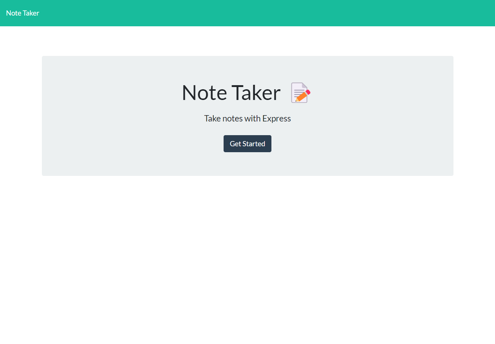
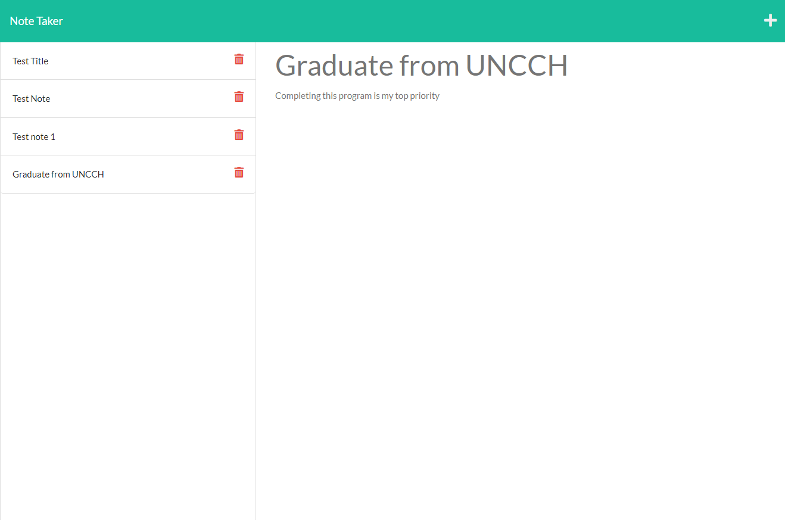

# Note Taker

## Contents
  1. [About](#about)
      1. [User Story](#user%20story)
      2. [Acceptance criteria](#acceptance%20criteria)
      3. [Visuals](#visuals)
      4. [Build](#build)
  2. [Installation](#installation)
  3. [License](#license)
  4. [Contributing](#contributing)
  5. [Tests](#tests)
  6. [Authors and acknowledgment](#authors%20and%20acknowledgment)
---
## About
 ### Using Express.js and Heroku for deployment. This application lets you take notes and save them to a database. This application also lets you keep the information and delete the notes when finished.
---
## Usage Info
  ### N/A
---
## Installation:
  Click the link below to go to the repository and clone the project

  To clone the repo:
  
      git clone https://github.com/Mpergolatti/Note_Taker
  
---
## License:

  Licensed under the [MIT](https://opensource.org/licenses/MIT) license.

  * For more information on license types, please reference this website
  for additional licensing information - [https: //choosealicense.com/](https://choosealicense.com/).
---
## Contributing:
  
  To contribute to this application, create a pull request.
  Here are the steps needed for doing that:
  - Fork the repo
  - Create a feature branch (git checkout -b NAME-HERE)
  - Commit your new feature (git commit -m 'Add some feature')
  - Push your branch (git push)
  - Create a new Pull Request
  Following a code review, your feature will be merged.

  Additional info below:

  Im the only contributor to this project

  
  

  [Heroku Deployment Link](https://intense-journey-23375.herokuapp.com/)

---
## Tests:
  N/A
  
---
## Questions and Comments:
* GitHub Username: Mpergolatti
* GitHub Email: Mpergolatti@gmail.com

